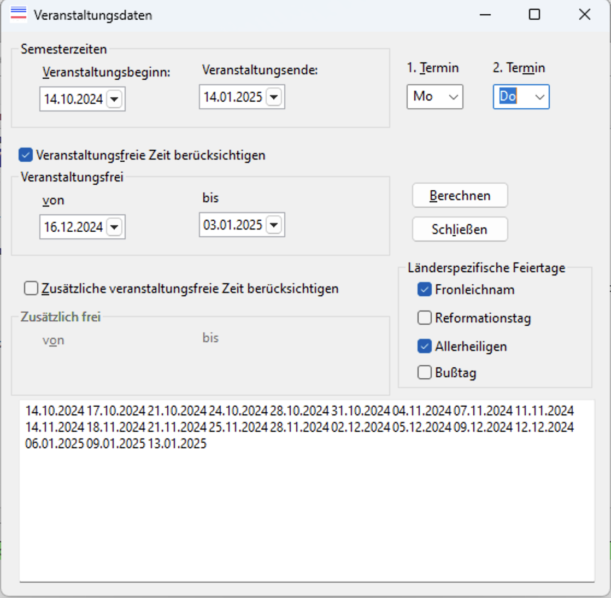

# Veranstaltungsdaten

Dieses Programm kann Hochschullehrern bei der Planung ihrer Lehrverantaltungen für ein bestimmtes Semester nützlich sein (ebenso selbstverständlich Lehrern an allgemeinbindenden Schulen, Musiklehrern usw.).  Es dient dazu, die Tage herauszufinden, an denen in einem spezifizierten Zeitraum (im Falle von Hochschulen also einem Semester) zu einem bestimmten Wochentag ein Arbeitstag und somit *kein* Feiertag ist, also eine Lehrveranstaltung stattfinden kann.

Die Daten werden als Texte in Spalten (durch Tabulaturzeichen getrennt) in die Zwischenablage kopiert und können von dort in eine beliebige Tabellenkalkulation oder Textverarbeitung eingefügt werden.

# Die Programmbedienung

Links oben wird unter `Semesterzeiten` das Datum der Beginn der ersten und das Ende letzten Veranstaltungwoche eingetragen. Darunter lassen sich analog zwei Ferienzeiten (z. B. Weihnachts-, Pfingstferien oder sonstige Abwesenheitszeiten) einplanen. Rechts werden ein oder zwei Wochentage angegeben, an denen die Veranstaltung stattfinden solle. Der zweite Wochentag muss *nach* dem ersten liegen.

Zusätzlich lassen sich die von Bundesland zu Bundesland verschiedenen Feiertage als solche markieren (Checkbox anwählen) oder eben nicht.

Bei jeder Eingabe wird automatisch eine Liste der Daten unten in dem Eingabefeld aktualisiert und zugleich in die Zwischenablage kopiert. Die Daten im Eingabefeld sind schreibgeschützt, können aber teilweise oder ganz markiert und mit dem üblichen Tastenkürzel (meist Strg+C) des Betriebssystems in die Zwischenablage kopiert werden.

Sollte die Zwischenablage zwischenzeitlich mit anderen Inhalten überschrieben worden sein, kann mit der Schaltfläche `Berechnen` der Inhalt jederzeit mit den vorgenommenen Einstellungen aktualisiert werden.

Das Programm wird mit dem betriebssystemüblichen Tastenkürzel oder auf die übliche Weise mit der Maus oder über die Schaltfläche `Schließen` beendet.

# Technisches

Das Programm wurde mit Lazarus 64 Bit für Windows in Free Pascal entwickelt. Für Linux oder MacOs müsste es ggf. angepasst werden. Die grundlegende Logik ist aber sortierbar. Das Programm steht unter der Lesser General Public License.

**Die Benutzung von *Veranstaltungsdaten* in kompilierter Form oder des Quellcodes und sämtlicher dazu übermittelter Dateien geschieht auf eigene Gefahr.** Der Verfasser ist für sämtliche Schäden, die direkt oder indirekt durch Nutzung des Materials entstehen, nicht haftbar.

Manfred Dings, musikundtheorie.de

E-Post: `musiktheorie`, gefolgt vom `@`-Zeichen, gefolgt von `musikundtheorie.de`. Anfragen an diese Mailadresse, welche meine Lehre, Prüfungen oder Studienberatung oder meine sonstigen Dienstaufgaben an der HfM Saar betreffen, werde ich zuverlässig ignorieren.
